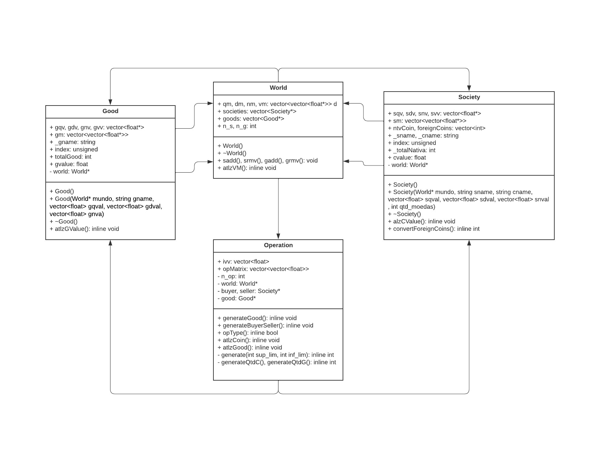
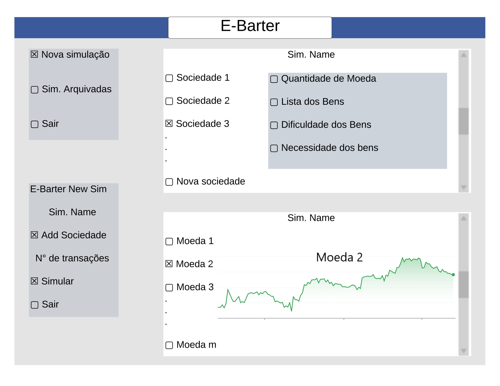
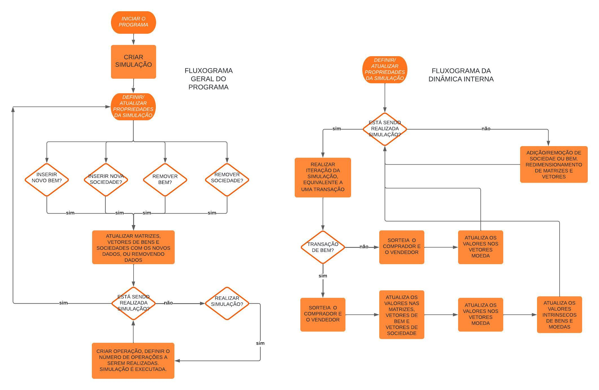

# E-Barter
Ideia chave:
Criar um app que simule o valor da moeda de diferentes sociedades fictícias.

Objetivo final:
O app possui tem finalidade educativa. O usuário pode ajustar parâmetros de bens e sociedades para alterar o rumo da simulação de forma a aproximá-la da 
realidade. Desse modo, o usuário aprenderá como diferentes fatores econômicos influenciam o preço de moedas em sociedades reais. 

Fatores que levam à variação do valor da moeda:

*quanitidades que as sociedades têm de cada bem.

*dificuldades e necessidades de possuir esses bens.

*negociação dos produtos com outras sociedades.

*negociação de moedas entre diferentes sociedades.

*determindada sociedade pode possuir parte de sua riqueza como moeda de outra sociedade.

## Diagrama de classes:

## Interface gráfica
# Esboço da interface gráfica:

Para interface gráfica do E-Barter será usada a biblioteca gráfica de Pyhon CustomTkinter.

Basta, instalá-la e importá-la no código. Funções como CTk() criam uma janela. O tamanho desta pode ser ajustada pela função geometry("dim1xdim2"). Para que a janela apareça é necessário criar um loop usando a função mainloop().

Para escrever algo na janela, basta usar a função CTklabel(janela,"text"), para adicionar uma imagem usa-se CTkImage(imagem = Image.open("imagem.png"). Cada texto ou atributo adicionado na janela pode ter sua posição ajustada pela função pack().

Pode-se adicionar um botão com CTkButton(janela,"text") e ele pode chamar uma função quando ativado: CTkButton(janela,"text",commad=function).

## Dinâmicas do programa:

## Instruções para rodar o programa:

No powershell devem ser dadas os seguintes comandos em sequência:

  g++ -c Ebarter.cpp -o Ebarter.o

  g++ Ebarter.o main.cpp -o nome_do_arquivo_executavel.exe

  g++ -std=c++11  Ebarter.o main.cpp -o nome_do_arquivo_executavel.exe -lws2_32

  ./nome_do_arquivo_executavel.exe

Em seguida, abra outro terminal e rode o código 'frontend.py'.

